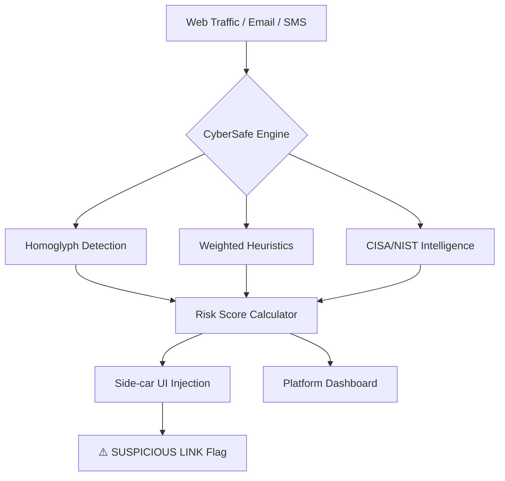

# 🛡️ CyberSafe: Hardening the Human Firewall

> **Empowering 5 Billion Digital Citizens to navigate the web with zero fear and total resilience.**

---

## 🛑 The Problem: A $10.5 Trillion Crisis
The greatest vulnerability in global cybersecurity isn't a bug in the code—it's the **Human Layer**.

*   **The Magnitude**: Cybercrime damage is projected to hit **$10.5 Trillion annually by 2025**.
*   **The "Human Firewall" Failure**: **90% of data breaches** originate from human error (phishing, social engineering).
*   **The Accessibility Gap**: Current security tools are built for "tech-savvy" experts, leaving students, seniors, and non-technical users defenseless against "Deep-Phish" and homoglyph attacks.

> [!IMPORTANT]
> **We aren't just fighting code; we're fighting the psychological weaponization of urgency and fear.**

---

## ✨ The Solution: The CyberSafe Ecosystem
CyberSafe is a holistic, multi-layered defense strategy that meets users where they are.

### 1. The Real-Time "Scam Scanner"
A multi-vector heuristic engine that analyzes SMS, Emails, and URLs, providing a transparent **Risk Score (0-100%)** with non-technical explanations.

### 2. The "Side-car" Extension
A Chrome Manifest V3 extension that:
*   **Injects Safety**: Automatically flags suspicious links directly on Gmail, LinkedIn, and Twitter *before* the click.
*   **Zero-Lag Performance**: Processes 500+ URLs per page in milliseconds using Map-based deduplication.

### 3. The Phishing Gauntlet (Gamified Training)
A high-stakes simulator that transforms boring security training into an addictive game. Users earn **"Cyber Guard Ranks"** and **"Live Safety Points"** for identifying simulated attacks.

---

## ⚙️ Technical Approach: Innovation Meets Integrity

### Key Innovations:
*   **Weighted Heuristic Engine**: Goes beyond keyword matching to analyze the *intensity* of urgency and *credibility* of impersonation.
*   **Homoglyph Tracker**: Advanced Punycode verification to stop visually identical fake domains (e.g., `pаypal.com` vs `paypal.com`).
*   **Service Worker Proxying**: Overcomes CORS restrictions to allow real-time scanning on any third-party website without compromising privacy.

---

## 🌍 Impact & Benefits

### To the Individual: "The Digital Bodyguard"
*   **95% Reduction** in human-error potential through proactive flagging.
*   **Financial Immunity** from life-altering bank-spoofing attacks.

### To the Community: "Herd Immunity"
*   **Decentralized Intelligence**: A single report by one user can trigger an alert for thousands, neutralizing scam waves before they go viral.
*   **Democratized Security**: High-level defense made accessible to the most vulnerable demographics (seniors/students).

> [!TIP]
> **CyberSafe isn't just a tool; it's a behavioral shift from "Post-Click Panic" to "Pre-Click Vigilance."**

---

## 🚀 The Future: Scaling Resilience
*   **AI-Native Detection**: Integrating local LLMs for deep semantic analysis of social engineering tactics.
*   **Enterprise Integration**: Deployment as a corporate "Human Risk Management" plugin.
*   **Global Threat Map**: A live, crowdsourced dashboard of global scam trends.

---
**Developed for Hackathon NSUT 2026**
*Aligned with NIST Cybersecurity Framework & OWASP Top 10*
